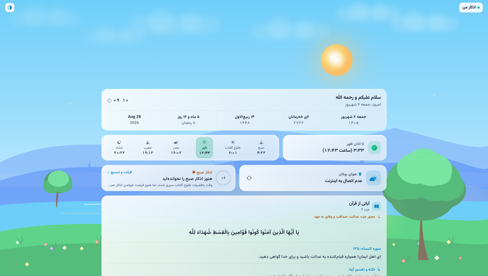

<div align="center">

# 🌿 اذکار من (Azkar & Prayer Times)

### اپلیکیشن پیشرفته اوقات شرعی، اذکار روزانه و تقویم اسلامی با طراحی مدرن شیشه‌ای (Liquid Glass)

[](https://flutter.dev)
[](https://dart.dev)
[](https://github.com/mmdsharifi/prayer-app/actions)
[](https://flutter.dev)
[](LICENSE)

<br/>



</div>

---

## ✨ قابلیت‌ها و ویژگی‌های کلیدی

### ☀️ مدار پویا و تنفسی خورشید و ماه (Celestial Sky Dynamics)
- **پیمایش قوسی واقعی در آسمان**: خورشید از افق شرق (راست) در هنگام طلوع بالا می‌آید، در هنگام ظهر شرعی به اوج آسمان (Zenith) و مرکز صفحه می‌رسد و در هنگام مغرب در افق غرب (چپ) غروب می‌کند.
- **تغییر داینامیک دما و رنگ**: کهربایی و نارنجی طلایی در سحر و غروب، زرد درخشان با هسته سفید در ظهر.
- **هاله اتمسفری چندلایه (Breathing Corona)**: پالس ملایم سینوسی ۶ ثانیه‌ای شتاب‌یافته روی GPU.
- **فازهای واقعی ماه بر اساس تقویم قمری**: در طول شب، ماه با شکل نجومی واقعی (هلال، تربیع، بدر کامل 🌕 یا محاق) متناسب با روز ماه قمری کاربر در آسمان حرکت می‌کند.

### 🕌 اوقات شرعی و شمارش معکوس هوشمند
- محاسبه دقیق ۶ وقت شرعی (صبح، طلوع آفتاب، ظهر، عصر، مغرب، عشاء).
- کارت یکپارچه شمارش معکوس تا نماز بعدی همراه با افکت شیشه‌ای و زمان‌بندی دقیق.
- هم‌ارتفاعی و تقارن پیکسلی کامل کارت‌های هم‌جوار در تمام رزولوشن‌ها.

### 📿 سیستم جامع اذکار صبح و شام (Azkar & Story Mode)
- **حلقه پیشرفت هوشمند (Circular Progress Ring)** با قابلیت ذخیره‌سازی محلی (Offline Persistence).
- **حالت تعاملی استوری (Story Mode)** و حالت فهرستی آکاردئونی با تفکیک متن عربی، ترجمه فارسی، کوردی و فضائل هر ذکر.
- پیشنهاد هوشمند اذکار روز بر حسب بازه زمانی شرعی (صبح، شام و اذکار عمومی).

### 🗓 تقویم جامع چهارگانه (Quad Calendar)
- نمایش هم‌زمان و تفکیک‌شده:
  1. **تقویم شمسی** (روز، ماه و سال خورشیدی)
  2. **تقویم کوردی** (روز، ماه کوردی و سال ۲۷۲۶)
  3. **تقویم قمری و فاصله تا ماه مبارک رمضان**
  4. **تقویم میلادی**

### 🌤 هواشناسی و امکانات معنوی روزانه
- دریافت لحظه‌ای دمای هوا و وضعیت جوی بوکان با قابلیت به‌روزرسانی دستی.
- **آیات جزء قرآن**: نمایش پیام محوری جزء، آیه منتخب، ترجمه و نکته تفسیری روز.
- **حدیث روز**: گزیده‌ای از احادیث صحیح نبوی با متن عربی، فارسی، کوردی و منبع.

### 🖥 پشتیبانی ویژه از مک‌او‌اس و وب
- **ویجت شناور رومیزی (Mini Floating Desktop Widget)** با کلید میانبر `⌘W`.
- منوبار زنده مک (`MenuBarService`) با نمایش اوقات نماز و اعلان‌ها.
- سازگاری ۱۰۰٪ واکنش‌گرا (Responsive) برای موبایل، تبلت و دسکتاپ.

---

## 🏗 معماری فنی و مهندسی نرم‌افزار

- **توسعه مبتنی بر آزمون (TDD - Test Driven Development)**: بیش از ۴۹ تست واحد و ویجت جامع با پوشش کامل منطق نجومی، فازهای ماه، کنترلر اذکار و تم‌ها.
- **ماژول دامنه عمیق (Deep Domain Architecture)**: کپسوله‌سازی کامل محاسبات تقویمی و شرعی در `PrayerSchedule` و `CelestialTrajectoryCalculator`.
- **الگوی Seam & Adapter**: جداسازی لایه داده با اینترفیس `IslamicDataRepository` (پشتیبانی از سورس آنلاین و کش آفلاین `AssetIslamicDataRepository`).
- **پرفورمنس حداکثری (Zero CPU Churn)**: ایزولاسیون گرافیکی انیمیشن‌های پس‌زمینه با `RepaintBoundary` اختصاصی و عدم ایجاد بار پردازشی اضافه روی CPU و باتری.

---

## 🚀 راهنمای نصب و اجرا

### پیش‌نیازها
- [Flutter SDK](https://docs.flutter.dev/get-started/install) (نسخه 3.24 یا بالاتر)
- Dart SDK (نسخه 3.5 یا بالاتر)

### کلون و اجرای پروژه
```bash
# ۱. کلون مخزن
git clone https://github.com/mmdsharifi/prayer-app.git
cd prayer-app/prayer_app

# ۲. دریافت وابستگی‌ها
flutter pub get

# ۳. اجرای تست‌های خودکار
flutter test

# ۴. اجرای برنامه روی وب یا مک
flutter run -d chrome
# یا
flutter run -d macos
```

### ساخت نسخه نهایی وب (Production Web Build)
```bash
flutter build web --release
```

---

## 🧪 آزمون‌ها و اعتبارسنجی کیفیت

برای اجرای تحلیل استاتیک کد و آزمون‌های خودکار:
```bash
# تحلیل استاتیک (بدون هیچ‌گونه خطا یا اخطار)
flutter analyze

# اجرای تمامی ۴۹ آزمون خودکار
flutter test
```

---

## 📦 استقرار خودکار (CI/CD)

پروژه به خط لوله خودکار **GitHub Actions** مجهز است که با هر کامیت در شاخه `main`:
1. کدهای برنامه را بررسی و تحلیل می‌کند (`flutter analyze`).
2. کلیه تست‌های خودکار را اجرا می‌کند (`flutter test`).
3. بیلد نسخه وب را آماده کرده و روی **GitHub Pages** مستقر می‌نماید.

---

## 📄 مجوز (License)

این پروژه تحت مجوز **MIT** منتشر شده است.
